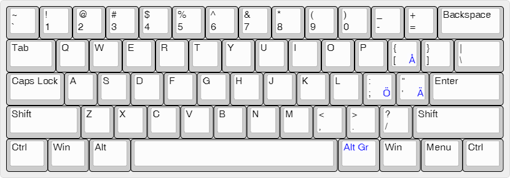

# Swenglish
The Swedish keyboard layout is in many ways suboptimal for programming and system administration. Many common special characters are typed using a modifier key (Shift or hard to reach AltGr) while the Swedish characters å, ä and ö are easily accessible but seldom used.

Searching for an alternative, one might stumble across the US ANSI keyboard layout where most special character used in programming are easily accessible. Most notably:

* Brackets and curly bracers are easier to type.
* Both Windows ( \ ) and Unix ( / ) path separators can be typed without a modifier key.
* Semicolon requires no modifier key.

Learning US ANSI (and Swenglish) is relatively easy as it shares the placement of all letters and digits with the Swedish keyboard layout. One only has to relearn the placement of the special characters.

Compared to the US International keyboard layout, Swenglish borrows the placement of the å, ä and ö characters from the Swedish keyboard layout. The characters are typed by using the AltGr modifier key.

A bonus advantage gained from switching to a US ANSI keyboard is that the range of mechanical keyboards gets much bigger!  :smiley:

## Preview
Modified keys are shown in blue.



## Install
Pre-built binaries for Windows and Mac OS X can be downloaded from [Releases](https://github.com/vertecx/swenglish/releases). After installation, Swenglish can be activated in the input settings of the operating system.

Run the following commands to install on FreeBSD:

```bash
fetch https://github.com/vertecx/swenglish/archive/v1.0.0.tar.gz
tar -xzf v1.0.0.tar.gz
cd swenglish-1.0.0/FreeBSD
(sudo) make install
```

> If fetch fails with a certificate validation error, install the [ca_root_nss](http://www.freshports.org/security/ca_root_nss) package or disable certificate validation using the --no-verify-peer option.

make will try to detect which console you run and give you the commands to run next.

If syscons is your console, run ```kbdcontrol -l us.iso.swenglish.kbd``` to test the keyboard layout and then add ```keymap="us.iso.swenglish"``` to ```/etc/rc.conf``` to make it permanent.

If vt is your console, run ```kbdcontrol -l us.iso.swenglish.kbd``` to test the keyboard layout and then add ```keymap="us.swenglish"``` to ```/etc/rc.conf``` to make it permanent.

## Modify and build
If you want to modify the keyboard layout or just prefer to build your own binaries, start by cloning or forking the Git repository. Then follow the platform specific instructions.

### Windows
Use [Microsoft Keyboard Layout Creator](https://www.microsoft.com/en-us/download/details.aspx?id=22339) to modify and compile the keyboard layout.

### Mac OS X
Use [Ukelele](http://scripts.sil.org/ukelele) to modify and install the keyboard layout. If you want to distribute your layout, Ukelele can also build an DMG installer.

If you've made modifications to the icons in Swenglish.iconset, run the following command to update the icons in Swenglish.bundle:

```bash
cd <Swenglish repository>/Mac
iconutil --convert icns --output Swenglish.bundle/Contents/Resources/Swenglish.icns Swenglish.iconset
```

### FreeBSD
Use your favorite text editor to modify the files. The file format is documented in [kbdmap(5)](https://www.freebsd.org/cgi/man.cgi?query=kbdmap&sektion=5).
